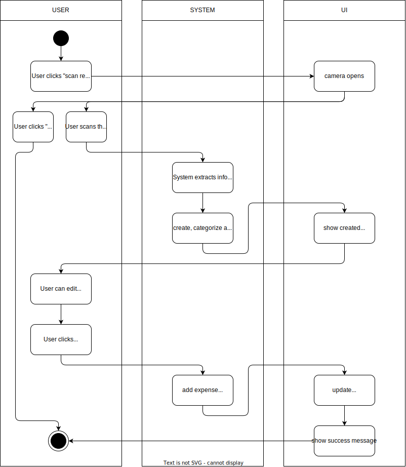

# 1. Use Case description

## Name of use case

Envisioned scanning receipts

## 1.1 Brief Description

Every user should be able to add data of a receipt using their camera. The data the mechanism has to automatically gather is the following:

- store (optional, best-effort basis)
- price
- date
- category
- income/expense

# 2 Flow of Events

## 2.1 Basic Flow

- User clicks on "New receipt" button. A menu opens.
- User selects "Scan receipt" button
- Inside the app a new page with a camera preview is shown
- User can scan a receipt
- Data gets checked for a valid format
- If the format is not valid an error message will pop up and the User will be returned to the form. Otherwise, the data will be processed, categorized and added to the history.
- The Dashboard will be updated
- Finally, the user is shown a success message

### 2.1.1 Activity Diagram



### 2.1.2 Mock-up


### 2.1.3 Narrative

```gherkin
Feature: automatic scanning

  As a signed in user
  I want to add a receipt by scanning a receipt
  in order to track my spent money.

  Background:
    And I am on the homepage

  Scenario: open new "Scan receipt" form
    Given I am signed in with username "USER" and password "PASSWORD"
    And I am on the "home" page
    When I press the "New receipt" button
    Then I see two additional buttons "Add manually" and "Scan receipt" fade in
    When I press the "Scan receipt" button
    Then I am on the "scanning receipt" form

  Scenario: scan valid data and save it
    Given I am signed in with username "USER" and password "PASSWORD"
    And I am at the "scanning receipt" form
    When I take a picture of a receipt
    And I get a overview of the detected data
    And there is an edit button
    When I can click the "Save" button
    And I receive a "success" message
```

## 2.2 Alternative Flows

(n/a)

# 3 Special Requirements

(n/a)

# 4 Preconditions

## 4.1 Login

The user has to be logged in to the system.

# 5 Postconditions

(n/a)

# 6 Extension Points

(n/a)
